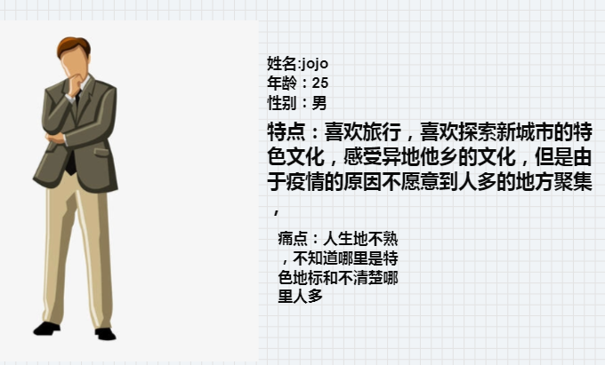

# 一、产品信息
| 产品名称 | 旅行助手|
|-------------------------------------------------------------------------------------|------|
| 产品简介 | 一款旅行前可以查询目标城市了解其文化与内涵，在旅行中可以拍照或图片识别当地特色美食，著名地标的应用（加入AI语音）。由于疫情原因建议不聚集人群，所以增添了对人流量监控对功能，给旅行者提供参考  |
| 产品现状 | 研发测试中  |
| 负责人 |周铭峰1910130030 |

# 二、价值主张设计

## 1、价值宣言

我认为现在旅行出行的人们要了解目标城市的途径不足，旅行助手对现在有的APP进行加值和优化。其中，该APP使用到的人工智能技术有图像识别中的菜品识别API、地标识别API和语音合成API，可以在拍照识别后返回识别到的菜品名称、菜品做法等信息，同时提供语言播报，通过使用语音合成API将文字通过语音形式念出来，提供另一种理解文字内容方式，除此之外，还融入城市推荐系统，提供旅行者更多优质选择，提高产品用户粘度和使用舒适度

## 2、核心价值

* 核心价值宣言：

解决出行者在异地"人生地不熟"问题，帮助解决他们想要了解特色菜品或当地坐标会遇到的问题，将为用户提供拍照识别菜品，地标、语言播报识别结果、以及人流量检测服务

* 菜品，地标识别：用户通过拍照或上传菜品，地标的图片，通过检测用户上传的图片进行识别检测，并返回识别结果

* 语言合成：能流畅的阅读出识别的文字信息，提供另外一种浏览方式

* 人流量识别：提供关于当地热门区域的人流量数据

## 3、人工智能概率性：
经测试后发现百度AI的菜品识别技术、地标识别技术和语音合成技术**存在的人工智能概率性问题有** ：
1.	当照片模糊时，可能出现识别结果不准确的问题
2.	识别技术只针对单一品种进行识别，当照片中存在多种菜品类别时，可能识别到的是面积最大的，而不是用户想识别了解的
3.	语音合成的概率性问题是可能合成过程中文字转换不到位，出现播报时文字读错的问题

除以上存在的概率性问题外，菜品识别技术、地标识别技术、语音合成技术在普遍情况下都可以正常使用，完成度和准确率都较高，可能产生的负面影响的概率性较小，对正面影响并不大，不妨碍整体功能的使用，也不妨碍本产品的加值主张
## 4、用户分析

### 目标用户群

主要目标用户：热爱旅行，喜欢了解异地美食，参观当地特色地标，希望可以了解当地热门景点人流量

   
   

### 用户痛点：
1.  旅游的时候，在异地吃到好吃的菜品想分享给好友却不知道叫什么
2.	在外游玩，不知道当地特色景区与地标
3.  疫情原因，避免人群聚集却因为不熟悉当地情况，不知道哪里人多哪里人少
4.	平时吃到好吃的菜品却不知道叫什么，怎么做
5.  想旅游，对目标城市不够熟悉

## 4、人工智能概率性与用户痛点：

> 市面上有很多关于查询路径规划，特色景区路线以及推荐特色店铺的饮用，想要进一步提高用户体验，提高解决用户使用舒适度和解决更多痛点是关键

> 人工智能的普及，对于出行人们带来了很大的便利，越来越多人来到人生地不熟的地方也可以游刃有余浏览众多当地特色景点，品尝特色美食

随着人工智能的不断发展，图像识别技术也运用的越来越广泛，其中，最常见的就是拍照识别类的APP，而本产品“旅行助手”，也属于拍照识物类的软件，其中运用到的百度AI开放平台中菜品识别API、语音合成API和地标识别API，人流量监控API具有以下优势：

* 菜品识别API、人流量识别API：

1.	准确度高，基于百度丰富的海量数据，利用深度学习技术及精准的算法迭代模型，不断提高准确度 ———— 能让出行者准确了解菜品的名称
2.	支持获得百科信息，让产品功能更完善、内容更丰富 ———— 能让旅行者了解当地更多特色信息
3.	稳定性好，提供24小时云端高温的服务，单图毫秒级响应，服务可用性高达99.95% ———— 能让旅行者通过拍照识别快速获取信息

* 语音合成API：

1.	支持多种语言多种音色，支持中文、英文混读，有男声、女声、童声可供选择，更支持语速、音调、音量设置，让应用具有更甜美和更磁性的声音，合成效果流畅自然，合成效果接近真人声音，流畅自然，且极具表现力，为用户带来最舒适的听觉体验  ———— 提供了另外一种浏览信息的方式，带来更极致的阅读体验

## 5、需求列表与人工智能API价值

### 需求列表（对应人工智能加值）

| 序号 | API技术 | 用户场景 | 优先级 | 是否属于人工智能 |对应人工智能加值|
|----|-------|------|-----|----------|-------|
|   1 |    菜品识别   |  用户想要知道菜品的名称    |   A（重要）  |   是       | 使用菜品识别技术进行拍照识别，获取用户想要的信息并返回结果，解决用户想快速了解菜品信息的问题|
|   2 |     语音合成  |  在返回识别结果后，用户在吃饭，可以用语音识别提供另外一种浏览信息的方式   |  B(次重要）   |       是   | 使用语音合成技术将返回识别结果转换成语音，用户点击可进行语音播报，提供更多浏览信息方式，优化用户体验 |
|   3 |     地标识别  |   用户想要查询当地特色景点地标   |  A（重要）   |   是       | 使用地标识别技术进行拍照识别，获取用户想要的信息并返回结果，解决儿用户身处他乡不熟悉当地情况的问题 |
|   4 |     人流量监测  |   用户由于疫情的影响，避免到人流量多的地方   |  A （重要）   |   是       | 使用人流量技术对当地地区进行进行，解决用户不了解当地情况，想要避免人群聚集的问题|

### 具体应用场景：

1. 一家人出行旅行，到餐馆吃饭，小孩子询问父亲菜品是什么？父亲对这个问题回答不上来，这时他打开了旅行助手APP，对菜品拍照识别，返回结果后告诉孩子

2. 出行旅行时，在餐馆吃饭，一家人查询菜品时想使用语音播报的形式对菜品进行讲解，这时他们打开了旅行助手app，对菜品进行语音播报

3. 小明到北京旅行，他想了解到底是故宫人流量多还是颐和园人流量多再决定今天去哪里玩，这时他打开了旅行助手app，查询了故宫和颐和园对人流量监测，做了决定
4. 小红到异地旅行，她看到一个非常宏伟到建筑，但是却不知道建筑的故事，这时，她打开了旅行助手app，查询了这个地标，了解到了这个建筑地标背后的故事。

### 需求论证利害相关者分析

随着科技的发展，到异地游玩的人越来越便利，但是由于文化和地域的差异，很多人对当地的饮食和特色地标并不是完全的了解，他们可以在碰到不认识的菜品或是不熟悉的建筑物时，拍照识别来清楚这一些旅行时碰到的"麻烦"，并且由于疫情的原因，出行避免人群聚集是很多人都需要做到的事情，但是由于人生地不熟所以知道那里人多，那里人少不是一件容易的事情，而本产品“旅行”只需要用户通过拍照即可得到菜品名称、特色地标的故事、百科描述，以及当地特色景区的人流量监控等。本产品中使用到的关键API人工智能技术对解决方案的可能关键影响论证如下：

| 利害相关者 | 目标需求 | 关键API | 分析 | 总结 |
|-------|----|-------|----|-------|
| 目标用户 | 使用本产品的拍照识别功能识别菜品，特色地标，并获取相关信息；使用本产品的语音播报功能将文字通过语音形式播报，解放双手双眼，获得极致体验 | 菜品识别API、地标识别API、语音合成API、人流量监测API| 1、菜品识别API、地标识别API在高概率成功识别的同时也存在小概率识别失败的问题，如用户输入的图片不清晰导致识别失败；还存在的小概率事件是识别结果可能存在偏差，如识别结果与实际不符，误导用户认知。 2、语音合成技术，可将文字转语音，但可能会有所偏差，导致认知错误 3、人流量监控可以有效的给用户提供参考出行| 利>害，虽然存在有偏差问题，不过是小概率事件，本产品为用户带来的利远远大于弊  |
| API提供平台 | 为本产品提供技术方面的支持，让平台的技术被更多的人群使用 | 菜品识别API、地标识别API、语音合成API、人流量监测API | 若使用产品的用户多，短时间内调用的频次高，存在的问题是当调用量无法预估时，关键技术能否支撑起高频次的调用，免费调用量能否满足产品需要？精确度能否再优化提升？ | 利>害，百度AI开放平台在国内来说算是较为有名且技术较为成熟稳定的一个平台，并且已经与一些软件达成了技术方面的合作，可见其技术的可行性，只要API提供平台提前预估可能发生的问题并及时做出解决，那么对平台带来的利益是非常不错的 |
| 产品开发者 | 产品功能满足用户基本需求，操作简单易上手，利用现有技术与知识制作软件界面，并融入交互设计的理念；产品核心技术稳定，不影响用户随时使用 | 菜品识别API、地标识别API、语音合成API、人流量监测API| 1、识别菜品或者地标时出现错误，从使用者的角度讲，很难在使用时通过自己的辨别发现软件识别出错。一般情况下，用户会默认是识别出了正确的菜品以及地标，一旦出现问题，会给使用者带来极其不好的使用体验，可能会造成用户流失  2、产品所占内存是否会太大，是否会影响用户使用  3、购买的调用量能否满足用户的调用次数，当调用次数用完后所产生的费用能否与产品收益相抵，能否为产品开发者带来可观的收益 | 利>害，虽然可能存在识别出错导致用户流失的问题，但都是小概率事件，由于产品选择了技术较好的平台作为支撑，所以造成的负面影响不会压过正面影响；产品会不断迭代更新，但在内存方面并不会占用用户过多资源；调用次数与调用所需费用可能不成比例，但当用户群体增多时，所造成的损伤都是可以弥补的 |

综上：
1. 菜品识别API、地标识别API在高概率成功识别的同时也存在小概率识别失败的问题，如用户输入的图片不清晰导致识别失败，为了提高用户体验，在本产品中创建了一个识别失败的页面提示用户，用户可以选择重新识别或退出识别，还存在的小概率事件是识别结果可能存在偏差，如识别结果与实际不符

2. 语音合成API，增加新的浏览方式是为了提高用户粘度，融合了语音合成技术，可将文字转语音，存在的可能播报错误导致用户理解偏差。为了减少错误的发生本产品语音合成部分选择了精确度较高、流畅度较好的百度AI开放平台作为技术支持

## 6、需求概述

### 产品背景

旅行出行，由于文化和地域的差异，当地特色的菜品和特色地标可能是用户不了解到，在碰到不了解的菜品或是特色地标时，可以通过拍照或是照片上传的方式来进一步了解，另外，为了避免人群聚集，使用旅行助手app也可以很好的给予用户出行建议。

### 产品市场

* 出行的人们总会吃到一些令人满意却又叫不上名字或是不知道做法的菜品，碰到这个时候，及时的了解可以提高人们在旅行时的幸福度。

*  在外游玩遇到特色地标，通过地标识别API，更好的了解到建筑背后的故事，让此次出行收获更多

* 由于疫情的爆发，减少人群聚集十分关键，使用人流量监测，可以避免到人群多的地方游玩，或是错峰出行，避免感染病毒

### 市场概述

* 市场特征

1. 智能识别市场广阔，增长迅速，目前正处于发展阶段智
2. 针对菜品识别和地标识别的软件应用并不多，此外，疫情的爆发的愿意，为人们避免人群聚集等功能的应用市场非常庞大
3. 对产品技术要求较高，需要契合场景要求，由于菜品的多样和地标丰富，并且为了提高使用舒适度，增添了语音播报的功能

* 发展优势

1. 旅行中的游玩总会遇到一些人生地不熟导致的问题
2. 用户痛点明显，具有一定的开发价值
3. 可以真正为旅行者解决问题，将会受到欢迎

#  三、产品设计原型

## 1、产品功能结构图

   

## 2、用户流程图

   

## 4、交互界面设计
   

## 5、界面流程设计分析

### 用户可欲性

* 产品功能基本满足目标用户需求，能够即时得到识别结果，用户可欲性强
* 除解决菜品和地标识别的问题外还融合了人流量监测，使得用户更好的出行体验
* 界面设计符合产品调性，且产品交互功能良好
* 操作简单，用户将手机对着菜品或是地标拍照，就能自动识别该菜品或是地标的名称，并提供更详细的信息，用户就像随身携带了导游
* 融入的语音播报解决的主要问题就是如何将文字信息转化为可听的声音信息，使机器具有类似于人一样的说话能力

### 商业可行性

* 智能识别市场广阔，增长迅速，目前正处于发展阶段
* 该产品具有明确的核心价值和使用需求，产品的市场未来需求趋势逐步增长
* 人工智能的深度学习功能，模型的更新和数据的积累会让系统的识别能力提高并且越来越精准，而且系统具有自主学习能力，识别的菜品或是地标的种类也会不断增加
* 伴随着人工智能行业的快速发展，中国在智能语音这个细分市场的发展速度也将会持续增长，因此融合了智能语音技术的软件也会得到发展

### 技术可行性

* 有平台可以直接调用相关API，且技术成熟稳定，可行性强
* 调用了百度ai开放平台的菜品识别技术、地标识别技术、人流量监控技术和语音合成技术，而这几个技术在其他产品软件中有使用过，说明技术可行
* 该产品API存在小概率的技术风险，但是此小概率风险对用户体验的负面影响不会压过正面影响的机率
* 对比了多家平台的API，选择了较为精确稳定的API对产品进行加值
* 语音合成技术，能将任意文字信息实时转化为标准流畅的语音并朗读出来，相当于给机器装上了一个嘴巴，它涉及到声学、语言学、数字信号处理、计算机科学等多个学科技术，是人工智能信息处理领域的一项前沿技术

## 6、信息设计（关键核心页面展示智能交互）

### 核心页面智能加值输入及输出描述
| 功能页面 | 识别结果页 | 地图流量图 |
|-----|-------|-----|
|    |    |      |
|   **智能加值输入描述** ：界面简洁明了无广告直奔功能应用，只需要点击按钮即可跳转到接下来的菜品识别或者是地标查询，人流量查询，简单好操作，查询应用了地标识别api与菜品识别api，仅需要拍照或者图库上传即可识别  |   **智能加值输出描述** ：在识别结果页，将用户输入的图片从百度AI开放平台的菜品识别API或地标识别API接口获取识别数据，返回结果；同时该页面提供了语音播报，使用了百度AI的语音合成API，可将返回的识别结果转成语音播报，用户点击“语音播报”即可合成语音      |   **智能加值输出描述** ：地图流量页中，用户可以查询城市不同地区的人流量情况，在地图的形式上展示，更利于查看，右下方还可以看到推荐出行指数，提供参考 |

## 7、原型文档
* [墨刀交互体验链接](https://modao.cc/app/213c043d6c2ce536a1bc1947bb03dbaa6af467c2?simulator_type=device&sticky)

# 四、数据推理
|  | 页面 |
|-----|--------------|
| 问题1 | 我们在页面上呈现什么内容 |
| 回答1 |  菜品识别和地标识别结果，以及人流量监测结果          |
| 问题2 |  向用户输出的结果内容从哪里来           |
| 回答2 |  从百度AI开放平台调用相应的API，根据用户输入的内容获得结果            |
| 问题3 |  输入的数据从哪里来？          |
| 回答2 |  输入的数据为用户拍摄/上传的照片、提前输入的故事内容，请求从百度ai开放平台相应的API接口获取            |
| 问题4 |  如果页面出现识别错误，应该如何获取并处理数据，正确的数据信息从哪里来  |
| 回答4 |  通过用户的反馈进行信息获取，通过用户的反馈扩大数据库，强化机器学习  |

## 1、数据流程图
 

## 2、数据流程设计分析

### 用户可欲性

* 数据传输快速，用户可随时识别并获取信息，相比百度搜索等其他方式，拍照识别更为快速，数据传输更为便捷
* 根据返回结果可随时进行语音播报，无需用户消耗过多的时间等待语音转换，节省用户时间
* 故事页已存在有数据，无需用户额外输入文字进行语音播报，方便用户使用
* 输出的识别数据储存在成就页面，用户可随时点击查看，无需再进行二次识别，节省用户时间
* 有强大的数据库作为支撑，错误率低，不容易误导用户认知，对用户体验好

### 技术可行性

* 根据拍摄照片，识别图片中菜品名称，获取菜品参考卡路里含量和百科信息，可结合识别结果进一步提供饮食推荐、健康管理方案等相关功能，增强用户体验，广泛应用于餐饮娱乐类和健康管理类APP中
* 地标识别API可识别众多地标的名称，适用于识别只含有一种地标的图片，可自定义返回识别结果数
* 语音合成API基于业界领先的深度神经网络技术，提供高度拟人、流畅自然的语音合成服务
*  人流量监测api算法领先,高精度头肩检测算法，准确率90%以上，静态人数统计不限人数，适应各种人群密集场所
灵活易用提供稳定易用的在线API、离线SDK、私有化部署包，适配各类终端接入需求服务稳定
可提供企业级稳定、精确的大流量服务，拥有毫秒级识别响应能力及99.9%的可靠性保障
* 语音合成技术已达到用户基本可接受的准实用水平，获得了较为广泛的应用，未来语音合成技术将从清晰度和自然度的要求上升至对个性化合成的要求，如对语音、语调、情绪的丰富性要求等

### 商业可行性

* 对于用户的粘性非常高，人流量监控api也非常符合现在的疫情防控措施
* 数据信息庞大，因此返回的数据较为全面，有利于产品发展，商业前景较好
* 不断强化机器学习，帮助产品达到更优效果，提升商业价值
* 在为海量用户提供菜品，地标识别服务的同时，可以积累大量的数据
* 对于用户授权的数据可进行商业之间的合作，将数据提供给有需要的开发者或企业商家，从合作方处获取相应的利益，充分利用数据，达到合作共赢的效果

# 五、API产品使用及输出

本产品调用的API均来自：[百度ai开放平台](https://ai.baidu.com/)

## 1、API代码部分

### （一）	菜品识别（使用百度API）

* 接口描述：该请求用于菜品识别。即对于输入的一张图片（可正常解码，且长宽比适宜），输出图片的菜品名称、卡路里信息、置信度。
* 接口地址：https://aip.baidubce.com/rest/2.0/image-classify/v1/plant
* 请求方式：POST
* 详细代码展示：[菜品识别代码展示](./code/菜品识别.md)   
* 百度api文档：[百度菜品识别api文档](https://ai.baidu.com/ai-doc/IMAGERECOGNITION/tk3bcxbb0)
### （二）语音合成（使用百度API）

* 接口描述：将计算机自己产生的、或外部输入的文字信息转变为可以听得懂的、流利的口语输出的技术，基于该接口，开发者可以轻松的获取语音合成能力，合成文本长度小于2048字节，如果本文长度较长，可以采用多次请求的方式。文本长度不可超过限制
* 接口地址：http://tsn.baidu.com/text2audio
* 请求方式：支持 POST 和 GET两种方式， 推荐POST方式请

* 详细代码展示：[语音识别代码展示](./code/语音.md)
* 百度api文档：[百度语音识别api文档](https://ai.baidu.com/ai-doc/SPEECH/Ek39uxgre)

### （三）	地标识别

* 接口描述：该请求用于识别地标，即对于输入的一张图片（可正常解码，且长宽比适宜），输出图片中的地标识别结果。
接口地址：https://aip.baidubce.com/rest/2.0/image-classify/v1/landmark
* 请求方式：POST
* 输入代码示例
* 详细代码展示：[地标识别代码展示](./code/地标识别.md)   
* 百度api文档：[百度地标识别api文档](https://ai.baidu.com/ai-doc/IMAGERECOGNITION/jk3bcxbih)

### （四）	人流量监测

* 接口描述对于输入的一张图片（可正常解码，且长宽比适宜），识别和统计图像当中的人体个数（静态统计，不支持追踪和去重）。 适用于3米以上的中远距离俯拍，以头部为主要识别目标统计人数，无需正脸、全身照，适应各类人流密集场景（如：机场、车展、景区、广场等）；默认识别整图中的人数，支持指定不规则区域的人数统计，同时可输出渲染图片。
接口地址：https://aip.baidubce.com/rest/2.0/image-classify/v1/body_num
* 请求方式：POST
  
* 输入代码示例
* 详细代码展示：[人流量监测代码展示](./code/人流量监测.md)   
* 百度api文档：[百度地标识别api文档](https://ai.baidu.com/ai-doc/BODY/7k3cpyy1t)

## 4、使用后风险报告：

产品使用可行性：

1. 技术方面可行性

* 该产品具有明确的核心价值和使用需求

* 该产品中的关键功能部分，选择了精准度高、符合用户痛点的API加值

* 调用的API技术风险小，且存在的小概率风险对用户体验的负面影响不会压过正面影响的概率

2. 市场方面可行性

* 用户需求明显，最小可行性功能能满足用户需求

## 5、人工智能概率性考量以及解决方案：
1.	当照片模糊时，可能出现识别结果不准确的问题
2.	识别技术只针对单一品种进行识别，当照片中存在多种菜品类别时，可能识别到的是面积最大的，而不是用户想识别了解的
3.	语音合成的概率性问题是可能合成过程中文字转换不到位，出现播报时文字读错的问题

解决方案：
1. 查询识别不准确：推荐用户手动输入关键词，帮助机器学习进行自我更正，并输出给用户更精确的答案，从而强化其数据库
2. 菜品或者是地标太多而导致的不准确信息，跳转出百科供给用户浏览。
3. 语音合成出现读字错误，信息反馈错误时，用户点击疑问后，跳转出错误文字，帮助机器自我更正。

# 六、该产品未来发展路线构想

* 发展理念：首先将菜品识别，地标识别，人流量监测功能研发完善，提供核心的价值，其次优化界面，优化用户体验，增加用户粘性，随后推出社区模式。

## 产品迭代过程构思
V1.0
* 实现菜品识别功能，返回菜品名称、百科信息，满足用户对了解菜品方面的需求
* 实现地标识别功能，返回地标名称，百科信息，满足用户对了解地标方面的需求
* 实现语音合成功能，将识别返回的文字进行语音播报，帮助儿童理解文字内容
* 实现人流量监测功能，将地区人流量统计通过地图的形式展示，给予用户出行参考

V2.0
* 以提高用户体验为目标，对页面进行优化完善，呈现更好的界面
* 对成就页面进行优化，增加了搜索页
* 对个人中心进行优化，增加使用按钮

# 七、心得总结及感谢
# 关于学习/实践心得总结及感谢
本文档是基础api_ml_ai课程的教学，在最后写出的prd文档，讲述了一个解决旅行者疫情期间出行，满足身在他乡的陌生对当地特色菜品，标志建筑对好奇心的应用，并引入“产品经理”和“用户视觉设计”课程的知识进行相关问题的思考和产品原型的制作。
### 特别感谢
1. 百度AI开放平台提供的api功能[百度ai开放平台](https://ai.baidu.com/)
2. 感谢师兄文档的参考书写。
- [张梓乐师兄作品“Fitness-helper"APP：gitee仓库链接](https://gitee.com/zzlhyy/API-Fitness)

